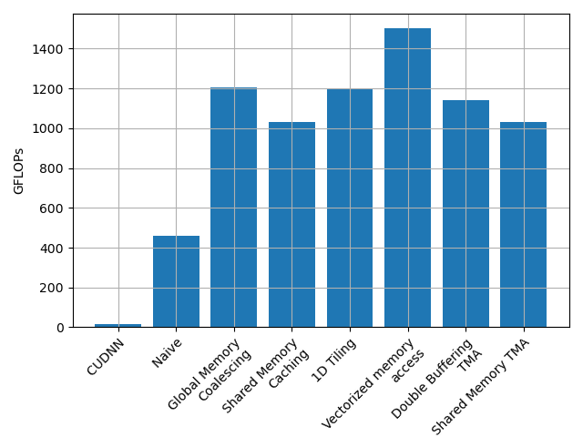
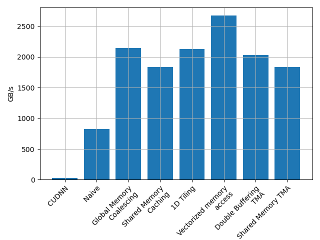

# CUDA 2D Convolution Optimization Journey

This repo is a step-by-step learning log on optimizing 2D convolution operations in CUDA with double precision (fp64), from basic implementations to advanced techniques using the latest hardware features on NVIDIA GPUs. I straight up copied the framework for this from [Simon Boehm's article](https://siboehm.com/articles/22/CUDA-MMM) on matrix multiplication optimization in CUDA. Like the matrix multiplication implementation is verified against that of CUBLAS, I verify the implementation of convolution against that of CUDNN. I practiced execution of all my codes on H100 GPU's.

## Why Convolution?

Convolution operations have memory access patterns similar to those found in second-order accurate finite volume CFD solvers when assembling discretized Navier-Stokes equations. By optimizing convolution, I hope to develop skills transferable to high-performance CFD applications. This project was also an exercise to learn the use of several AI assistants for code generation. Finally, the literature on the internet is filled with optimization of tf32 and lower precision arithmetic. However, documentation on optimizatoin of fp64 arithmetic on GPU's is rather sparse! 

## High level thoughts

The arithmetic intensity of matrix multiplication of two `N x N` matrices is $2 N^3/ 3 N^2 \sim O(N)$. However, for convolution, I only need to access the immediate neighbors of a given point in the matrix. For a `3 x 3` filter of an `N x N` matrix with zero padding, I have 9 multiplications and 8 additions per point. This gives an arithmetic intensity of $ 9 N^2 / 2 N^2 \sim O(1)$. Thus simple `3 x 3` convolution kernels are always likely to be memory bound rather than compute bound. This makes the importance of memory layout, access patterns and hiding latency ever more important. In practice, I found that I could wrap the actual convolution computations in these kernels in a loop of several 100 times without affecting the performance in any noticeable manner confirming the memory bound nature of the operation. 

## Convolution Optimization

I explore various optimization techniques for 2D convolution operations in CUDA copying from [SiBoehm](https://siboehm.com/articles/22/CUDA-MMM). I start with a naive implementation and progressively incorporate optimization techniques including:


1. Global memory coalescing
2. Shared memory blocking
3. 1D Block tiling (1D)
4. Vectorized memory access
5. Double buffering
6. Tensor Memory Accelerator (TMA) utilization

For a kernel that takes $\Delta t$ s to execute, I calculate the flops as $9 N^2 / \Delta t$ and the bandwidth as $2 N^2 / \Delta t$. Surprisingly the vectorized memory access kernel was the fastest achieving very close to the advertised maximum bandwidth of 3 TB/s!

## Performance Figures



*Figure 1: Achieved FLOPS across different convolution kernel implementations.*



*Figure 2: Achieved memory bandwidth across different convolution kernel implementations.*


## Brief notes on each kernel 

This documentation follows our journey through increasingly sophisticated optimization techniques:

CUDNN
-----
I have a fairly naive implementation of the cuDNN call. However, I get a really poor performance of just 16 GFLOPs. I just downloaded the precompiled CUDNN archive and compiled against it. I can't seem to use anything other than the simple GEMM method. Winograd and direct implementations don't seem to work for me. Not sure why. I've left my attempts to use other methods in the commented out code in there. I'm pretty certain that my cudnn performance numbers are quite wrong. If someone can tell me how they're wrong, I'd be grateful!

Kernels 1-4 and 6
-----------------

These follow rather straightforward adaptations of whatever Simon Boehm did for matrix multiplication. Some extra thoughts here are the following

1. It's impressive how much of a speed up global memory coalescing gives me compared to the maximum total speed.
2. I'm surprised that hand-written vectorized memory access is the fastest kernel. The maximum vectorized global memory load is 128 bytes and that's just a double2 unlike float4! 2668 GB/s is pretty close to the advertised bandwidth of 3 TB/s. Someone please correct me if I'm wrong on this! I think further attempts at optimizing this kernel may not be worth the time.
3. It doesn't make sense to do more than 1D block tiling. Adjacent threads have to access adjacent places in memory. 2D block tiling would break that, my attempted kernel on that was definitely slower and I didn't bother commiting it. 
4. I didn't see shared memory bank conflicts when using Nsight compute when looking at ratio of actual/ideal memory calls to shared memory. I suppose my padded approach to shared memory allocation took care of this problem. So I didn't bother investigating this further.
5. In all of these kernels, I didn't create shared memory for the output matrix. Perhaps it's something I could try in the future.

TMA and Double buffering
------------------------

I really thought using Tensory Memory Access would be faster than my hand-written kernel! For some reason it's slower and no better than a naive shared memory caching approach. Not sure why. 

Also, I thought a double buffering approach would help me hide some more latency than a simple approach. That's slower! 


## Lessons learned for CFD implementation

CFD codes are definitely going to be memory bound, more so unstructured codes compared to structured codes. I have 16 variables stored per cell for a 2D stuctured grid code in laminar flow (2 velocities, pressure, 3 nonlinear residuals, 10 Jacobians). Total memory storage for N cells is 16 * N * 8 = 128 N bytes. I conservatively need order 1000 iterations to converge to some steady state. Each iteration would need to go through entire memory atleast 3 times for nonlinear residual evaluation and probly say 100 times for matrix vector products for sparse linear solvers. So the total time to convergence of my solution should be (1000 * 100 * 128 * N) / 3 TB/s  = 4.267s per million cells. If I can eliminate storage of Jacobians and evaluate matrix vector products in a matrix-free fashion, this number drops down to 1.6s per million cells. This would be a number to target in my next implementation of a CFD solver using everything I've learnt here. If succesful, that could have profound implications on computational aerodynamics and not to the mention the immense potential of these GPU's to generate training data for AI!


## Hardware Requirements

* CUDA-capable GPU (Hopper architecture H100 recommended for TMA kernels)
* CUDA Toolkit 12.0 or higher. My performance numbers here are with CUDA 12.9
* cuDNN library for baseline comparison


## Installation and Usage

```bash
# Clone the repository
git clone https://github.com/gantech/convolution_cuda.git
cd convolution_cuda

# Create build directory
mkdir build && cd build

# Configure and build
cmake -DCUDA_CUDNN_DIR=PUT_CUDNN_DIR_HERE ..
make

# Run the benchmarks
./conv2d [0,1,2,4,6,11,13]
```
